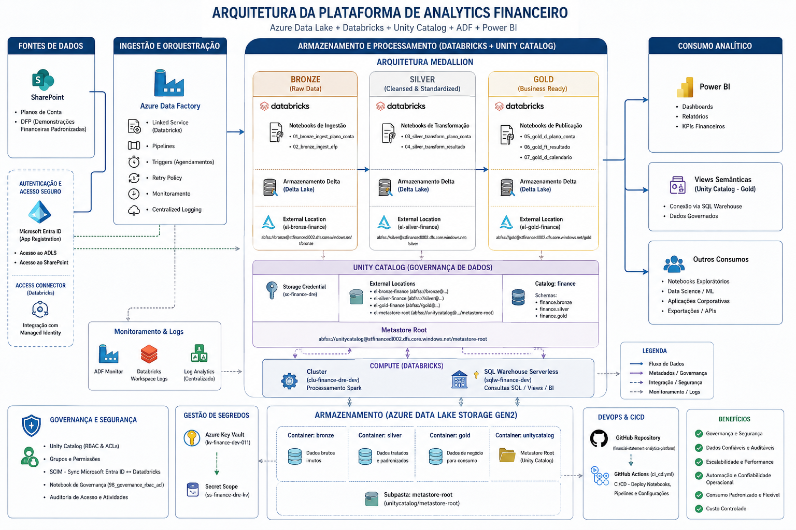
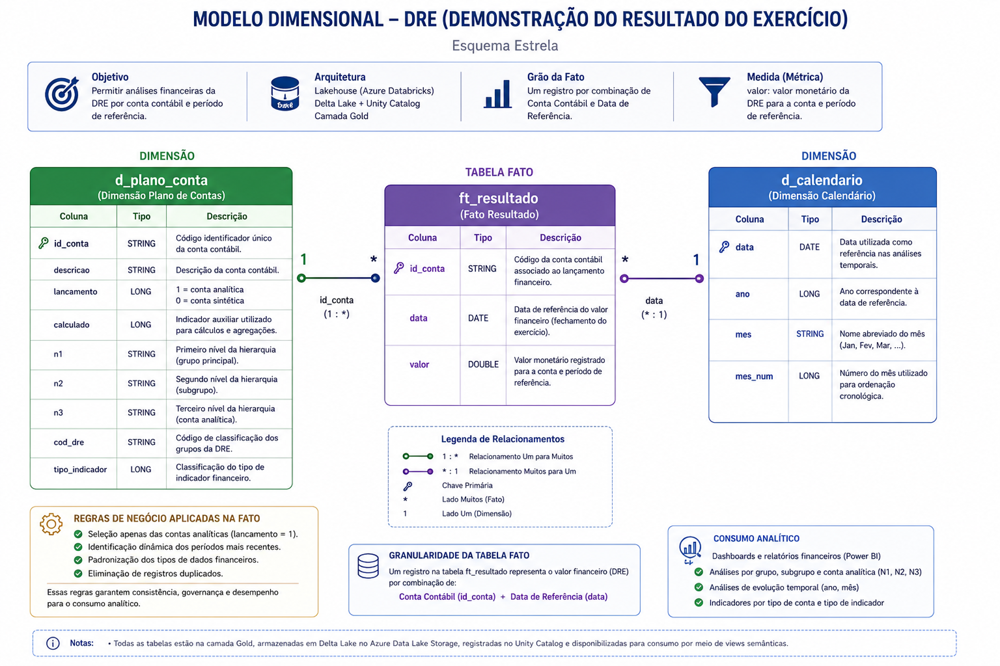

# 2. Arquitetura da Solução

## 🎯 Objetivo

Implementar uma plataforma moderna de Engenharia de Dados utilizando serviços do **Microsoft Azure**, garantindo escalabilidade, governança, segurança e rastreabilidade ao longo de todo o pipeline, desde a ingestão até o consumo analítico.

A solução segue o padrão **Medallion Architecture**, separando claramente as etapas de ingestão, tratamento e disponibilização dos dados.

---

## 🧱 Visão Geral da Arquitetura

A arquitetura foi implementada utilizando serviços gerenciados do Microsoft Azure, integrando:

* SharePoint Online como fonte de dados
* Azure Data Factory para orquestração dos pipelines
* Azure Databricks para processamento distribuído
* Azure Data Lake Storage Gen2 para armazenamento
* Delta Lake para persistência transacional
* Unity Catalog para governança dos dados
* Azure Key Vault para gerenciamento de credenciais
* Microsoft Entra ID para autenticação e controle de acesso
* Power BI para consumo analítico

**Fluxo principal:**

```text
SharePoint Online
        │
        ▼
Azure Data Factory
        │
        ▼
Azure Databricks
        │
        ▼
 Bronze → Silver → Gold
        │
        ▼
Power BI
```

📷 

---

## 🪵 Bronze (Raw Data)

### 🎯 Objetivo

Centralizar e preservar os dados provenientes das fontes de origem, garantindo rastreabilidade e possibilidade de reprocessamento.

### 📥 Características

* Ingestão automatizada de arquivos Microsoft Excel
* Padronizações técnicas mínimas
* Inclusão de metadados de ingestão
* Persistência em tabelas Delta
* Preservação dos dados originais

### 📦 Artefatos

* `plano_conta`
* `dfp`

---

## 🥈 Silver (Trusted Data)

### 🎯 Objetivo

Transformar os dados brutos em estruturas padronizadas, consistentes e reutilizáveis para análises.

### 🔧 Características

* Limpeza e padronização dos dados
* Aplicação de regras de negócio
* Estruturação hierárquica do plano de contas
* Transformação dos dados financeiros (Unpivot)
* Criação de atributos derivados
* Preparação para modelagem dimensional

### 📦 Artefatos

* `plano_conta`
* `resultado`

---

## 🥇 Gold (Business Data)

### 🎯 Objetivo

Disponibilizar dados governados e organizados em modelo dimensional para consumo analítico.

### 📊 Características

* Modelo dimensional (Star Schema)
* Tabelas Delta governadas
* Views semânticas para BI
* Otimização para consultas analíticas
* Integração com Power BI

### 📦 Tabelas

* `d_plano_conta`
* `ft_resultado`
* `d_calendario`

---

## ⭐ Modelo Dimensional

A camada Gold disponibiliza um modelo dimensional otimizado para análises financeiras.

* **Fato:** `ft_resultado`
* **Dimensão:** `d_plano_conta`
* **Dimensão:** `d_calendario`

📷 

---

## 🔄 Pipeline de Dados

Fluxo operacional da plataforma:

```text
SharePoint Online
        │
        ▼
Azure Data Factory
        │
        ▼
Azure Databricks
        │
        ▼
Bronze → Silver → Gold
        │
        ▼
Power BI
```

### ⚙️ Características

* Orquestração com Azure Data Factory
* Processamento distribuído no Azure Databricks
* Execução sequencial entre as camadas
* Separação entre ingestão, transformação e consumo
* Publicação automatizada da camada Gold

---

## 🛠️ Componentes Tecnológicos

| Categoria                   | Tecnologias                              |
| --------------------------- | ---------------------------------------- |
| Fonte de Dados              | SharePoint Online, Microsoft Excel       |
| Processamento               | Azure Databricks, Apache Spark (PySpark) |
| Armazenamento               | Azure Data Lake Storage Gen2, Delta Lake |
| Governança                  | Unity Catalog                            |
| Orquestração                | Azure Data Factory                       |
| Gerenciamento de Segredos   | Azure Key Vault                          |
| Gerenciamento de Identidade | Microsoft Entra ID                       |
| Arquitetura                 | Data Lakehouse, Medallion Architecture   |
| Modelagem Analítica         | Modelo Dimensional (Star Schema)         |
| DevOps e DataOps            | Git, GitHub, GitHub Actions              |
| Consumo Analítico           | Power BI                                 |

---

## 🔗 Rastreabilidade

### 🪵 Bronze

* `01_bronze_ingest_plano_conta`
* `02_bronze_ingest_dfp`

### 🥈 Silver

* `03_silver_transform_plano_conta`
* `04_silver_transform_resultado`

### 🥇 Gold

* `05_gold_d_plano_conta`
* `06_gold_ft_resultado`
* `07_gold_d_calendario`
