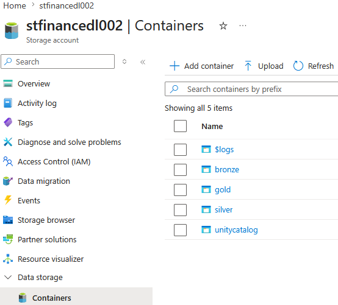
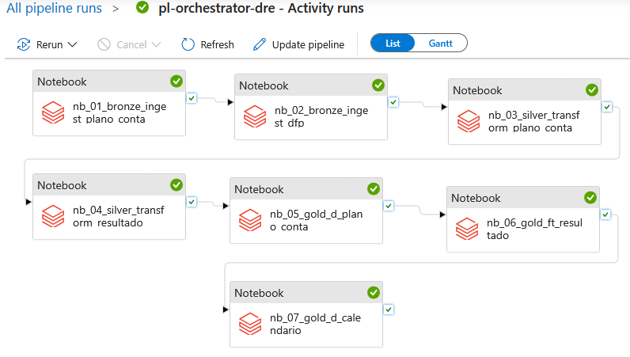

# 9. Runbook de Implantação

> Este runbook apresenta a sequência recomendada para implantação da plataforma, desde o provisionamento da infraestrutura até a validação do ambiente.

---

## ✅ Pré-requisitos

Antes da implantação, verifique a disponibilidade dos seguintes recursos:

- Microsoft Entra ID
- Azure Resource Group
- Azure Data Lake Storage Gen2
- Azure Key Vault
- Azure Databricks
- Azure Data Factory
- Power BI Desktop

---

## 🏗️ Provisionamento da Infraestrutura

Execute a implantação na seguinte sequência:

1. Resource Group
2. Azure Data Lake Storage Gen2
3. App Registrations
4. Access Connector
5. Azure Key Vault
6. Azure Databricks
7. Azure Data Factory
8. SQL Warehouse
9. Microsoft Entra ID

---

## 💾 Configuração do Armazenamento

Criar os containers utilizados pela arquitetura Lakehouse:

```text
bronze/
silver/
gold/
unitycatalog/
└── metastore-root/
```

Após a criação da estrutura:

- Configurar Storage Credential
- Configurar External Location
- Configurar Managed Identity
- Armazenar credenciais no Azure Key Vault

📷 

---

## ⚙️ Configuração do Databricks

Preparar o ambiente de processamento:

- Criar Catálogo
- Criar Schemas
- Configurar Unity Catalog
- Criar Cluster
- Criar Workspace Folder
- Configurar Databricks Secrets

---

## 📒 Publicação dos Notebooks

Publicar os notebooks respeitando a organização do projeto:

- Bronze
- Silver
- Gold
- Governance

**Estrutura dos Notebooks**
```text
notebooks/

bronze/
    01_bronze_ingest_plano_conta
    02_bronze_ingest_dfp

silver/
    03_silver_transform_plano_conta
    04_silver_transform_resultado

gold/
    05_gold_d_plano_conta
    06_gold_ft_resultado
    07_gold_d_calendario

governance/
    98_governance_rbac_acl
    99_delta_lake_acid_demo
```
    
---

## 🔒 Configuração da Governança

Executar as etapas de segurança da plataforma:

- Criar grupos no Microsoft Entra ID
- Configurar SCIM Provisioning
- Sincronizar grupos com o Databricks
- Executar o notebook de governança
- Aplicar permissões RBAC e ACL

🔗 Script:

👉 [98_governance_rbac_acl.py](../notebooks/governance/98_governance_rbac_acl.py)

---

## 🔄 Configuração da Orquestração

Configurar o pipeline no Azure Data Factory:

- Linked Service do Databricks
- Atividades de Notebook
- Dependências entre etapas
- Retry Policy
- Publicação do Pipeline
- Schedule Trigger

📷 

---

## 📊 Configuração da Camada Analítica

Após a execução do pipeline:

- Configurar SQL Warehouse
- Conectar o Power BI ao Databricks
- Consumir as views semânticas do Unity Catalog

Views publicadas:

- `vw_d_plano_conta`
- `vw_ft_resultado`
- `vw_d_calendario`

---

## ✔️ Validação da Implantação

Verificar:

- Pipeline executado com sucesso
- Tabelas Bronze, Silver e Gold criadas
- Views semânticas publicadas
- SQL Warehouse operacional
- Power BI conectado
- Permissões aplicadas
- Governança configurada
- Recursos ACID funcionando

---

## 🎯 Resultado Esperado

Ao final da implantação, a plataforma deverá disponibilizar:

- Arquitetura Medallion operacional
- Pipelines automatizados
- Dados governados pelo Unity Catalog
- Armazenamento em Delta Lake
- Controle de acesso por grupos
- Views semânticas para BI
- Integração com Power BI
- Monitoramento operacional
- Recursos ACID (History, Time Travel e Restore)
