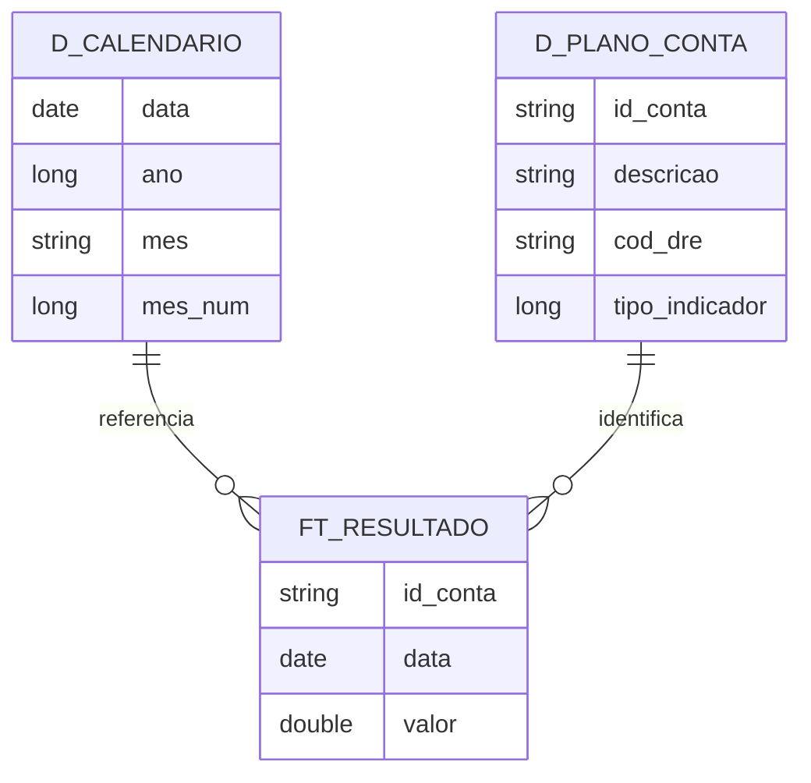

# 🥇 Gold (Business Data)

Camada responsável pela modelagem dimensional, aplicação das regras de negócio financeiras e disponibilização dos dados analíticos para consumo por ferramentas de Business Intelligence.

Nesta etapa, os dados confiáveis da camada Silver são transformados em entidades corporativas otimizadas para análises gerenciais, indicadores financeiros e construção do modelo semântico.

---

## 🎯 Objetivo

- Implementar o modelo dimensional analítico (Star Schema)
- Construir dimensões e tabela fato corporativas
- Aplicar regras de negócio da Demonstração de Resultado (DRE)
- Disponibilizar dados preparados para análises financeiras
- Criar camada semântica para consumo por ferramentas de BI
- Publicar entidades governadas no Unity Catalog
- Garantir rastreabilidade através do Delta Lake

---

## 📓 Notebooks

- [05_gold_d_plano_conta.py](./05_gold_d_plano_conta.py)  
- [06_gold_ft_resultado.py](./06_gold_ft_resultado.py)  
- [07_gold_d_calendario.py](./07_gold_d_calendario.py)  

---

# ⚙️ Processamento

Nesta camada são aplicadas as principais transformações analíticas da plataforma.

---

## 📘 Dimensão Plano de Contas

Responsável por disponibilizar a estrutura contábil utilizada nas análises financeiras.

### Processos aplicados:

- Leitura da entidade tratada na camada Silver
- Construção da dimensão corporativa de contas
- Preservação da hierarquia contábil
- Controle de unicidade das contas
- Preparação para relacionamento com a tabela fato

### Tabela publicada

```
finance.gold.d_plano_conta
```

### View semântica

```
finance.gold.vw_d_plano_conta
```

---

## 📊 Fato Resultado Financeiro

Responsável pela consolidação dos valores financeiros utilizados nos indicadores da DRE.

### Processos aplicados:

- Leitura dos dados financeiros tratados na camada Silver
- Integração com a dimensão Plano de Contas
- Identificação dinâmica dos períodos mais recentes
- Aplicação da regra de contas analíticas
- Estruturação das medidas financeiras
- Particionamento físico por ano
- Publicação da tabela fato

### Tabela publicada

```
finance.gold.ft_resultado
```

### View semântica

```
finance.gold.vw_ft_resultado
```

---

## 📅 Dimensão Calendário

Responsável pela criação da dimensão temporal utilizada nas análises financeiras.

### Processos aplicados:

- Geração da dimensão de datas
- Criação dos atributos temporais
- Organização dos períodos financeiros
- Preparação para análises históricas
- Suporte aos relacionamentos temporais da tabela fato

### Tabela publicada

```
finance.gold.d_calendario
```

### View semântica

```
finance.gold.vw_d_calendario
```

---

# ⭐ Modelo Dimensional

A camada Gold implementa um modelo dimensional baseado em Star Schema.



---

# 🧱 Características da Camada Gold

A camada Gold representa a camada de negócio (*Business Data*) da plataforma.

Principais características:

- Modelo dimensional Star Schema
- Dados preparados para análise gerencial
- Regras de negócio financeiras aplicadas
- Entidades governadas pelo Unity Catalog
- Persistência em Delta Lake
- Views semânticas para consumo analítico
- Estruturas otimizadas para Power BI e ferramentas de BI

---

# 🔗 Integração

Detalhes sobre arquitetura, regras de negócio e fluxo de dados:

👉 [Desenvolvimento do Projeto](../../docs/03_desenvolvimento.md)

---

# 📌 Observação

A camada Gold representa a visão analítica final da plataforma, consolidando os dados tratados nas camadas Bronze e Silver.

As tabelas publicadas nesta camada são utilizadas como fonte oficial para relatórios financeiros, dashboards gerenciais e análises de desempenho, permitindo consumo padronizado e governado através do Unity Catalog.
